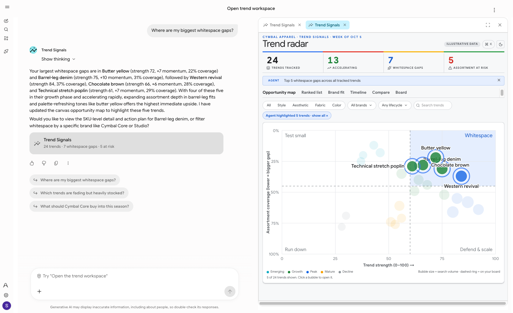
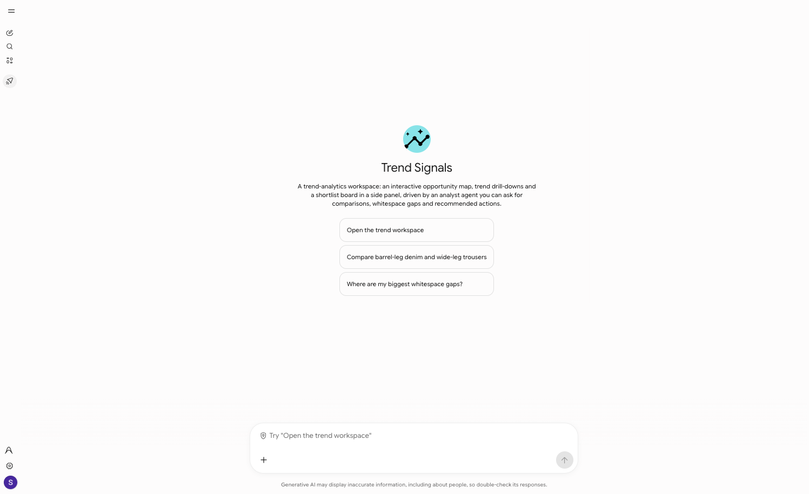
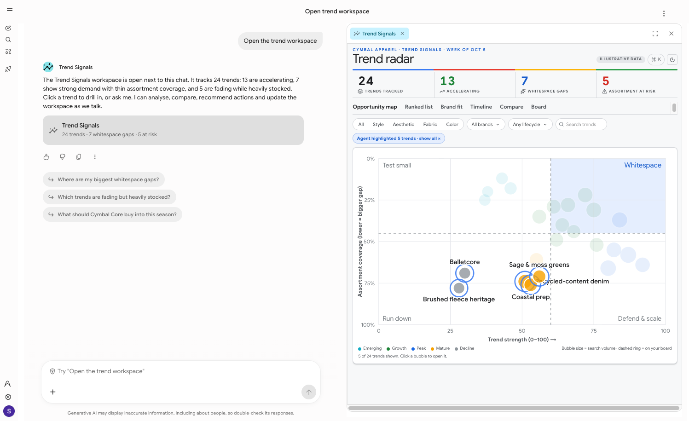
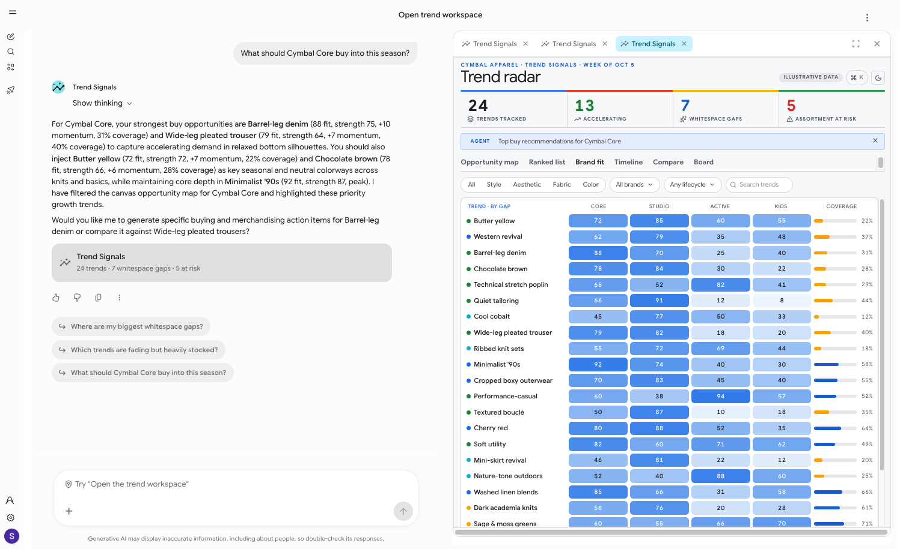
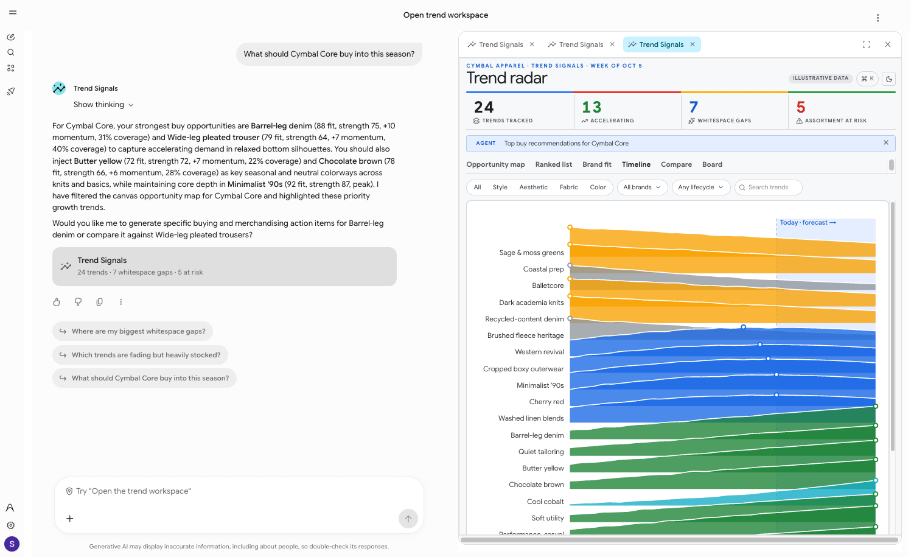
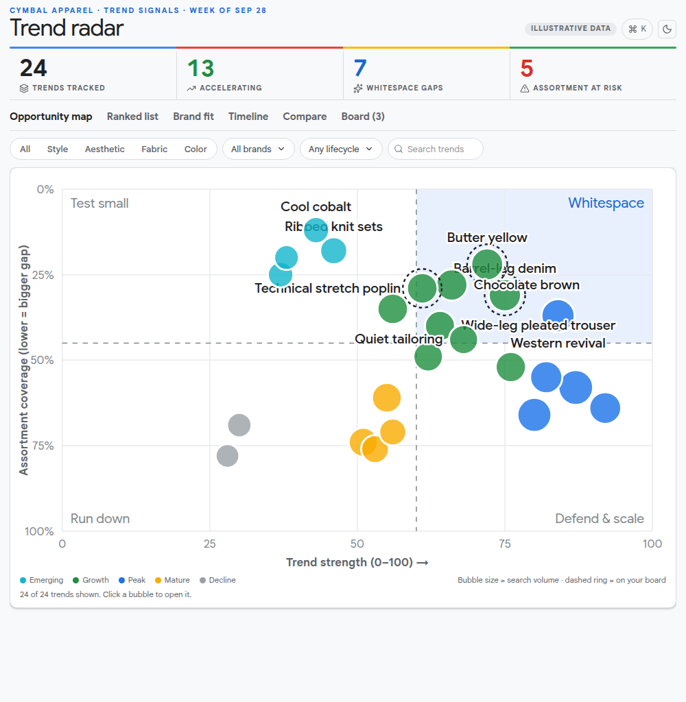
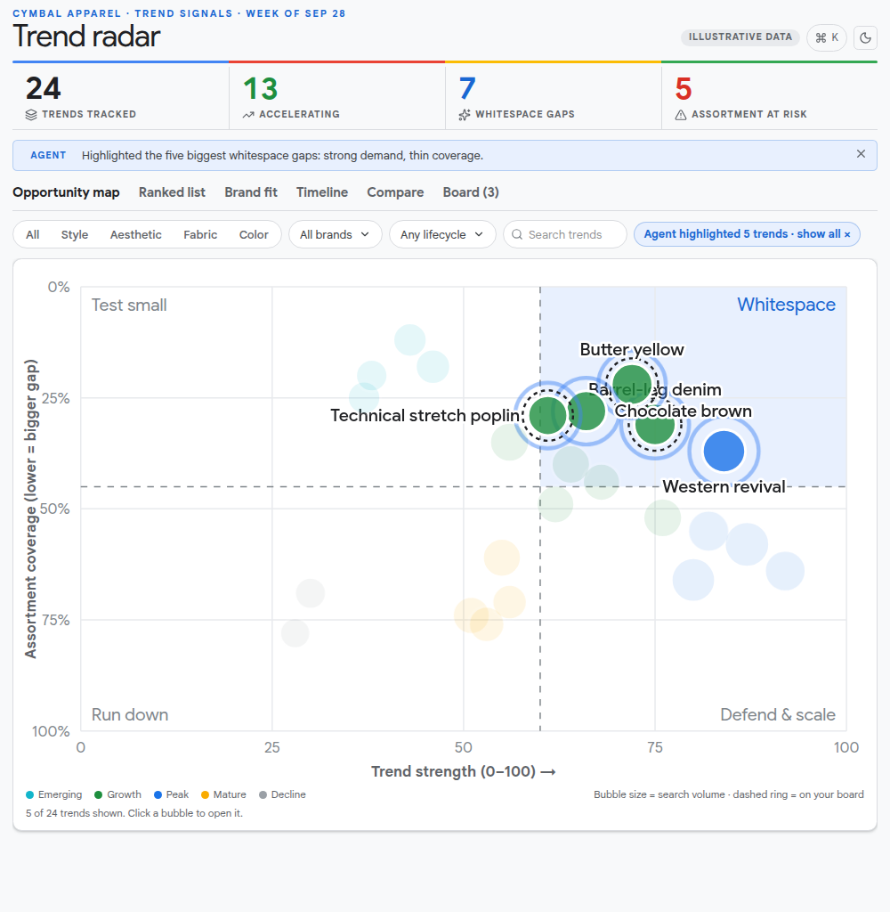
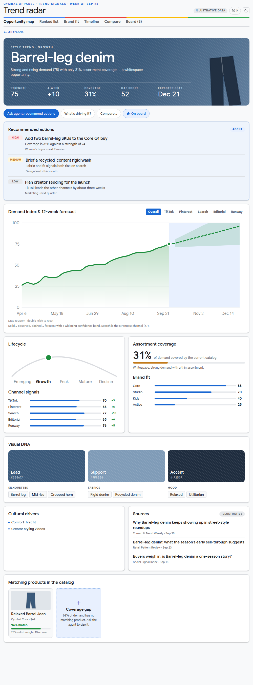
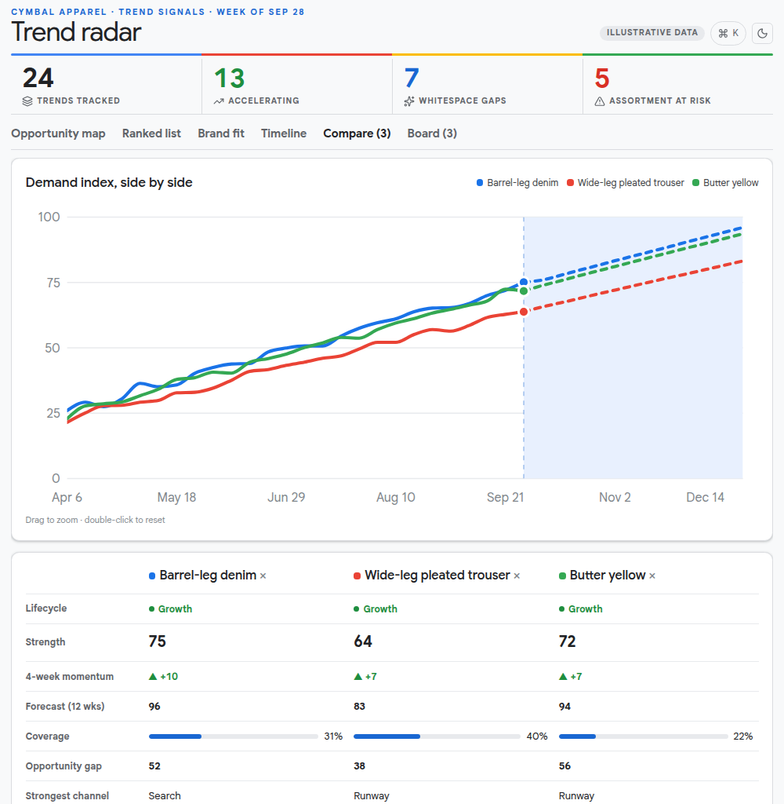
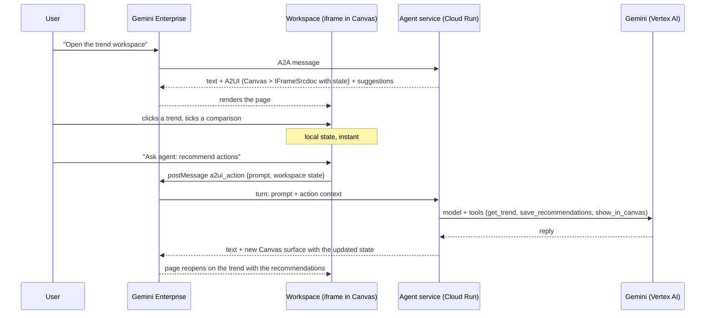

# Trend Signals: an agentic analytics workspace for Gemini Enterprise

This repository is a reference blueprint. It shows how an analytics product can run inside Gemini Enterprise as an
interactive workspace next to the chat, with an agent behind it that analyzes the data, answers questions and
changes what the workspace shows.



*In Gemini Enterprise: the user asks "Where are my biggest whitespace gaps?" The agent answers in the chat, and the
workspace in the Canvas side panel highlights the five trends it names, with a banner that says what changed.*

| The agent in Gemini Enterprise | Open the workspace |
|---|---|
|  |  |

| Brand fit for a buying question | Demand timeline |
|---|---|
|  |  |

The example is fashion trend analytics for a fictional retailer, Cymbal Apparel: an opportunity map of trends against
assortment coverage, ranked lists, trend drill-downs with demand forecasts, comparison and a shortlist board. The data
is synthetic. The experience and the way the agent and the workspace talk to each other are the subject of the
blueprint; a governed data product replaces `catalog.py` when it is used for real.

### The workspace views

| Opportunity map | Agent highlights what it names |
|---|---|
|  |  |

| Trend detail with agent recommendations | Comparison |
|---|---|
|  |  |

## What the blueprint demonstrates

* **A custom workspace in the Canvas side panel.** The page is a React application built to one HTML file and
  delivered in an `IFrameSrcdoc` component inside a `Canvas`, using A2UI v0.9 and the Gemini Enterprise composite
  catalog. Charts are SVG; there is no external asset or network call.
* **A Google Cloud look, and richer views.** The page uses Tailwind, Radix primitives, d3 and Motion: an opportunity
  map, a ranked list, a brand-fit heatmap, a ridgeline timeline of every demand curve, trend pages with a poster
  header tinted by the trend's palette, brush-to-zoom forecasts, a command palette (Ctrl/⌘ K or `/`) that can also ask
  the agent, and a light and a dark theme.
* **Local interaction without a round trip.** Tabs, filters, drill-down, the shortlist board and the comparison are
  client-side state over the data in the page, so they respond immediately.
* **Canvas to agent.** The page can only post an action to Gemini Enterprise. Every action carries the workspace state
  (view, selected trend, comparison, board, filters, highlights, scroll position) and a prompt that becomes the user's
  message. The agent knows what the user is looking at.
* **Agent to canvas.** The agent's tools analyze the data and change the workspace state. After the reply, the server
  renders the workspace again with that state: a different view, a highlighted set of trends, written recommendations,
  a banner that says what changed.
* **A real agent.** An ADK agent with Gemini calls tools to search trends, read one in depth, compare, scan the
  assortment for gaps and risks, and edit the board. Typed questions and workspace actions use the same path.

## How it works



The page cannot call the agent and cannot receive a reply. A reply is a new Canvas surface, so each response remounts
the page with the state the agent chose. The page restores the scroll position and keeps the rest of the state in the
action context, so the round trip does not lose the user's place.

More detail: [docs/HOW_IT_WORKS.md](docs/HOW_IT_WORKS.md) explains the build in depth; [docs/THEMING.md](docs/THEMING.md) explains the styling system; [docs/ARCHITECTURE.md](docs/ARCHITECTURE.md) is the short reference.

## Repository layout

| Path | Content |
|---|---|
| `src/trend_signals/catalog.py` | The illustrative dataset: 24 trends, 22 SKUs, forecasts, channel signals. Replace this with a data product. |
| `src/trend_signals/tools.py` | The agent's tools. Read tools return compact data; `show_in_canvas`, `update_board` and `save_recommendations` change the workspace. |
| `src/trend_signals/ui_state.py` | Per-conversation workspace state shared by the page, the tools and the instruction. |
| `src/trend_signals/state.py`, `canvas.py` | The state injected into the page, and the Canvas surface that carries it. |
| `src/trend_signals/executor.py` | One A2A turn: opens the workspace, runs the agent, attaches the workspace to the reply. |
| `src/trend_signals/kit/` | The generic Gemini Enterprise and A2UI plumbing: wire builders validated against the catalog, parts, click normalization, identity. Reusable in any agent. |
| `frontend/` | The workspace page: React, TypeScript, Tailwind, Radix, d3, Motion, Vite single-file build. `scenes/trends/` holds the charts and views. |
| `registration/`, `deploy/` | Registers the agent in a Gemini Enterprise app; deploys it to Cloud Run. |
| `scripts/chat.py` | Talks to the agent over A2A and prints the reply and the workspace state, locally or deployed. |
| `tests/` | Unit tests: data, tools, canvas validation against the catalog, click handling. |
| `scripts/ge_client.py` | Talks to the registered agent through the Gemini Enterprise API (the per-agent A2A endpoint). |
| `skills/`, `AGENTS.md` | Agent skills and instructions for a coding agent such as Antigravity (see below). |

## Quick start (offline)

```bash
make install            # uv sync, npm ci
make frontend-build     # builds the single-file page
make test               # unit tests; the canvas messages are validated against the A2UI catalog
make gallery            # the page on :5173 with the illustrative data, no agent needed
make screenshots        # renders every view from the production bundle (uv run playwright install chromium)
```

Run the agent locally and talk to it. The model calls need a Google Cloud project with Vertex AI and Application
Default Credentials.

```bash
cp .env.example .env    # set GOOGLE_CLOUD_PROJECT
make run                # A2A server on :8080
uv run python scripts/chat.py --context demo "hi"
uv run python scripts/chat.py --context demo "Where are my biggest whitespace gaps?"   # same --context, same workspace
uv run python scripts/chat.py --context demo --action ask --ctx '{"view":"detail","sel":"t02"}' "Recommend actions for Barrel-leg denim"
```

## Deploy to Gemini Enterprise

```bash
make enable-apis        # once per project
make deploy             # Cloud Run service trend-signals-agent, built from source
make register-dry       # prints the registration request
make register           # creates or updates the agent in the Gemini Enterprise app
```

`GEMINI_ENTERPRISE_APP_ID` is the app (engine) id from the Gemini Enterprise console. Gemini Enterprise keeps a static
copy of the agent card, so run `make register` again after any change to `card.py`. The service is private; the
Discovery Engine service agent receives the Cloud Run invoker role during `make deploy`.

## Adapting it

* **Data.** `catalog.dataset()` returns one dict that both the page and the tools read. Build the same shape from a
  governed table or API and nothing else changes. The page receives all data in its state, so keep it under the 1 MiB
  limit of one A2UI message (the current state is about 70 KB).
* **Tools.** Add a tool that reads the data, and, if it should change what the user sees, have it set `ui_state` and
  call `request_update`. The executor renders after the reply.
* **Views.** The page is `frontend/src/scenes/TrendsScene.tsx` and `scenes/trends/`. Colors, type and spacing come from
  `frontend/src/lib/tokens.css`.
* **Latency.** One model call is limited to `MODEL_CALL_TIMEOUT_MS` (40 s) with retries, and a whole turn to
  `TURN_TIMEOUT_S` (85 s); Gemini Enterprise gives up on a slow agent, so the agent stops first and says so.
* **Identity.** Workspace state is keyed by the conversation (the A2A `contextId`, `kit/identity.py`), so each
  conversation has its own workspace. To keep state per user across conversations, resolve the user from a verified
  credential (for example an OAuth token from a Gemini Enterprise authorization) and key the state by that. Never key
  it by message metadata: the caller sets it.

## Constraints of the Gemini Enterprise frame

* The iframe is sandboxed with scripts only: no network, no links that navigate, no storage. All data is in the page.
* The page reaches the agent only through an `a2ui_action` message; `data.prompt` becomes the user's message.
* A reply cannot update a Canvas surface that is already open, so each reply creates a new surface.
* The frame height is set in pixels (Gemini Enterprise has no "fill the panel" option) and the Canvas panel does not
  scroll, so the page is an app shell: the header and tabs stay put and the content region scrolls inside a fixed
  1024 px frame.
* One A2UI message is limited to 1 MiB.

## Working with a coding agent

[AGENTS.md](AGENTS.md) gives a coding agent such as Antigravity or Gemini CLI the layout, the commands and the rules of
this repository. Two skills in [skills/](skills/README.md) load automatically in Antigravity (`.agents/skills.json`):

* `ge-agentic-workspace`: building or adapting an agent-driven workspace like this one.
* `gemini-enterprise-a2ui`: A2UI v0.9 for Gemini Enterprise in general, with an offline payload validator.

## License

Apache License 2.0. See [LICENSE](LICENSE).
