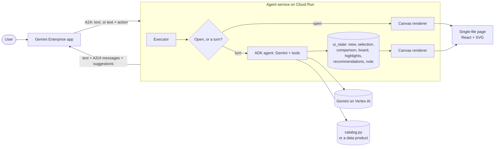

# Architecture

The short reference. [HOW_IT_WORKS.md](HOW_IT_WORKS.md) explains the build in depth.

This document describes how the workspace page, the agent service and Gemini Enterprise exchange state, and the
decisions behind the design.

## Components



| Component | Responsibility |
|---|---|
| Workspace page (`frontend/`) | Renders all views from the state in the page. Handles tabs, filters, drill-down, comparison and the board locally. Posts an action to Gemini Enterprise to reach the agent. |
| Executor (`executor.py`) | Turns an A2A request into either a deterministic "open the workspace" reply or an agent turn. Stores the workspace state that arrives with an action. After the agent's reply, renders the workspace if a tool asked for it. |
| Agent (`agent.py`, `tools.py`, `prompts.py`) | An ADK `LlmAgent`. Its instruction states what the workspace showed at the user's last action. Tools analyze the data and change the workspace state. |
| `ui_state.py` | The shared state: what the page shows, plus what the agent wrote into it. In memory, keyed by user. |
| `kit/` | Protocol plumbing that does not depend on the use case. |

## The two directions

### Workspace to agent

The iframe is sandboxed and cannot make network requests. Its only outbound channel is a `postMessage` to Gemini
Enterprise:

```ts
window.parent.postMessage({ type: "a2ui_action", action: "ask",
  data: { ...workspaceState, prompt: "Recommend actions for Barrel-leg denim" } }, "*");
```

Gemini Enterprise shows `data.prompt` as the user's message and sends the agent an A2A message with that text and a
v0.9 action data part whose `context` is `data`. `executor.read_click` reads the structured context, which keeps values
that contain `;` or `=` intact, and `ui_state.remember_click` stores it. The agent's instruction is built per call from
that state, so a reference such as "this trend" resolves to the selected trend.

The state that travels with every action:

| Key | Meaning |
|---|---|
| `view` | `map`, `list`, `detail`, `compare` or `board` |
| `sel` | selected trend |
| `cmp`, `board`, `hl` | comparison, shortlist and highlighted trends (comma-separated ids) |
| `metric` | the signal source shown on the demand chart |
| `ft`, `fb`, `fl`, `fq` | type, brand, lifecycle and text filters |
| `sy` | scroll offset of the page's content region |

The typed chat message carries no workspace state, so the agent uses the state of the last action. Navigation that the
user did locally since then is not visible to the agent until the next action.

### Agent to workspace

Tools that change what the user sees write to `ui_state` and call `request_update`. When the model's final response
arrives, `_CanvasInjector` renders the workspace (`canvas.render`) and stashes it; `final_panel.FinalPanelQueue`
attaches it to the closing event. Gemini Enterprise treats messages sent while the agent is still `working` as
collapsed "thinking" content, so a surface attached there would be hidden.

A surface that already exists cannot be updated from a later turn in the Gemini Enterprise app, so each reply creates
a new surface. Creating a Canvas surface reopens the panel with the current state. The page keeps the user's place by
restoring `sy` (the content region's scroll offset) when the agent re-renders the same view and by carrying filters,
selection and board in the state. The page is an app shell in a fixed 1024 px frame: the header stays put and the
content region scrolls.

## Message shape

One reply is, in order: a text part, one A2UI data part per message, and a suggestions data part.

```
TextPart                           the answer, as chat text
DataPart application/json+a2ui     createSurface   (composite catalog id)
DataPart application/json+a2ui     updateComponents:  Canvas(root) > IFrameSrcdoc(htmlContent, height)
DataPart application/json+suggestions   follow-up chips (at most three, 85 characters each)
```

`kit/v09.Surface.messages` validates every surface against the Gemini Enterprise composite catalog with the public A2UI
Agent SDK before it is sent, so a malformed surface fails in the service and in the tests, not in the user's browser.
The agent card declares the A2UI v0.9 extension with the composite catalog in `supportedCatalogIds`; without that,
Gemini Enterprise binds the surface to the basic catalog and reports that components are not found.

## The page

`kit/srcdoc.py` reads the built single-file bundle (about 560 KB) and splices the state before `</head>`:

```html
<script>window.__TREND_SIGNALS_STATE__={...};</script>
```

Every `<` in the JSON is escaped (`\u003c`) so a string cannot close the script element or open a comment. The bundle carries a
`Content-Security-Policy` meta of `connect-src 'none'`, which keeps the page offline when it is opened directly;
Gemini Enterprise removes the element and applies its own policy.

The state is one dict built by `state.build`: the dataset (trends, products, brands, weekly series and forecasts), the
workspace state, the recommendations the agent wrote, a one-shot note, and suggestions. The TypeScript counterpart is
`frontend/src/lib/trends.ts`.

## Data

`catalog.py` generates a deterministic dataset: 24 trends with strength, momentum, lifecycle stage, coverage, brand fit,
five channel series, a 12-week forecast with a confidence band, cultural drivers, visual DNA, source articles, and
matches to 22 SKUs. The retailer, trends, SKUs and publications are fictional. To use a real source, return the same
shape from `dataset()`; the tools and the page read nothing else.

## Decisions

| Decision | Reason |
|---|---|
| One agent, one workspace | The workspace is the product surface; the chat is the conversation about it. Both read the same state. |
| All data in the page | The frame cannot fetch. This keeps drill-down, filtering and chart hover instant. |
| Actions carry state | The agent needs to know what the user is looking at, and the frame cannot be queried. |
| Render after the reply | The canvas then reflects what the agent did in this turn, including recommendations it wrote. |
| Structured tool arguments as delimited strings for recommendations | `save_recommendations` takes `"priority \| owner \| timing \| action \| why"` strings and rejects malformed ones with a message the model can act on, which avoids open-ended object schemas in the function declaration. |
| No fallback paths | If the canvas fails to render, the reply says so and the log has the cause; the service does not substitute a different experience. |

## Limits of this sample

* Workspace state is held in memory per service instance. Cloud Run may route two turns of one conversation to
  different instances; for more than a single presenter, move `ui_state` to a shared store such as Firestore.
* Workspace state is keyed by the conversation (A2A `contextId`, `kit/identity.py`), never by caller-set metadata;
  the store keeps the most recent 500 workspaces.
* The data is synthetic and static for the day. Connecting live sources (social platforms, trend providers, internal
  sales and inventory) is outside the scope of the blueprint.
